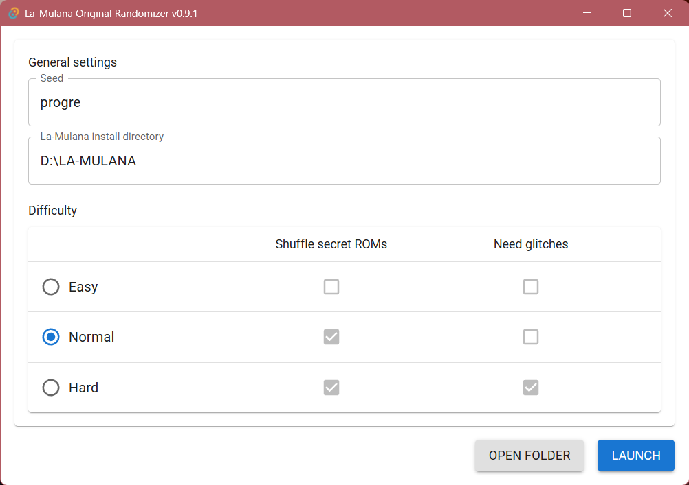

La-Mulana (Original version) Randomizer
====

  

Randomizer for La-Mulana (Original version). Original game is found at [Internet Archive](https://archive.org/details/La-Mulana)

This tool was inspired by [La-Mulana Randomizer](https://github.com/thezerothcat/LaMulanaRandomizer/wiki).

**[Latest version is here](https://github.com/progre/lmorandomizer/releases)**

----

Information
----

This application randomizes items in the La-Mulana script.dat file. Even after randomization, you can finish the game (but it may contain bugs...).

If you feel stuck, see some tips below. They may help.

----

How to use
----

Place seed and La-Mulana install directory, select options, then push Apply.

### Current restrictions

- Items in *True Shrine of the Mother* and *Night Surface* aren't replaced.
  This means whatever is in the *Death Seal* location does NOT carry over to *True Shrine of the Mother*. Get it before killing all 8 guardians.
- *Mini Doll*, *Pepper*, *Anchor*, and *Mulana Talisman* are still given by their respective NPCs.
- ROMs acquired from scanning are not changed.
- Item names in shops are mismatched with actual item.

### Constraints on the system

- Certain situations can cause a softlock. For example, going to *Dimensional Corridor* without *Bronze Mirror*.
- Shops can't display some items.
  - Maps
  - Sacred Orbs
  - Main Weapons and Sub Weapons that aren't Ankh Jewels and Pistol

### Stuck?

- The *Talisman*, *Diary*, and *Treasure* are still there even if they're overwritten by a different item on the inventory screen.
- The top right section of *Spring in the Sky* is accessible without the helmet. Use the *Feather* and *Grapple Claw* to get on the elevator.
- The bombable wall in *Graveyard of the Giants* can be opened from the left side if you have *Bombs* and enough health.
- Palenque's section of *Chamber of Extinction* can be accessed through the Gate of Time. Climb up the ladder and you get warped there.
